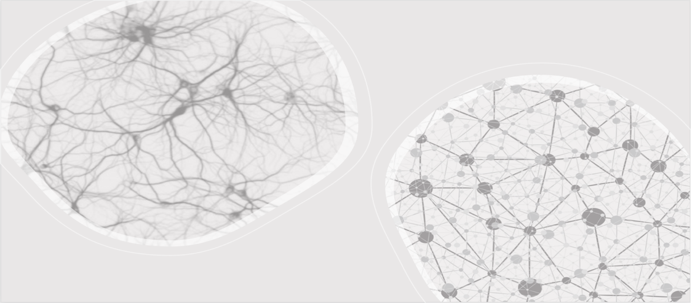

# Rand2AI Team

We are a research team of [Computer Vision and Machine Learning Lab](http://csvision.swansea.ac.uk/) at the Department of Computer Science, Swansea University, UK. Our research interests are in machine learning and artificial intelligence in general ranging from theory, through to methodology and applications in biomedical science. We focus on studying learning robustness including privacy and security aspects, generative learning using probabilistic graphical models with minimum supervision, and learning theory facilitated from stochastics analysis in both continuous and discrete forms, differential geometry and statistical physics. Our routine research activities can be found in our [wiki](../../wiki) page.

## Highlight

## Publication

## Soft/Hard-wares
